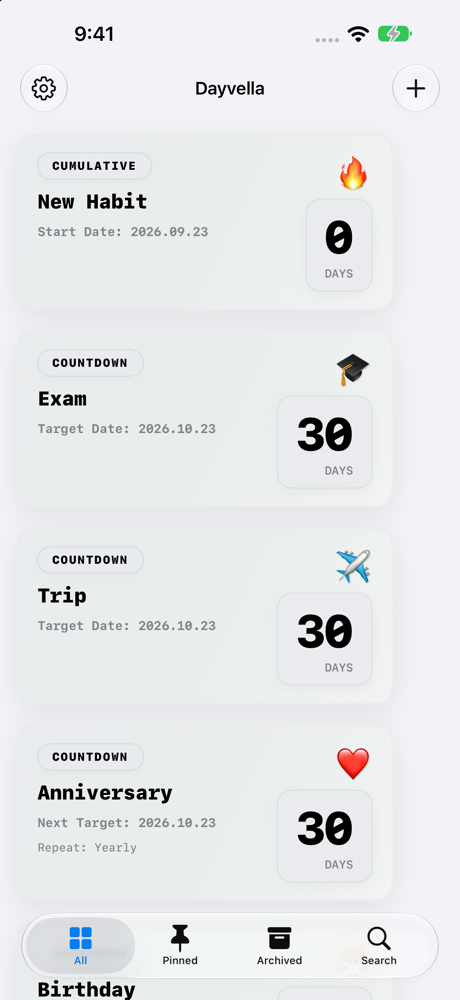

# Dayvella

[Discord](https://discord.gg/eGzEaP6TzR)

Repository: <https://github.com/everettjf/dayvella>

[Website](https://xnu.app/dayvella/) · [App Store](https://apps.apple.com/app/id6753280745)

The landing page and [privacy policy](https://xnu.app/dayvella/privacy/) are
published from [`docs/`](docs/) with GitHub Pages (`main` branch, `/docs`).
The project site inherits `xnu.app` from the account site, so these URLs stay
the same. The pages use shared CSS, icons, and navigation assets from the main
`xnu.app` site; keep those root-relative asset paths working when editing them.

Previously named CountMyDays. Dayvella is an update to the same app, not a separate installation.

Dayvella is a SwiftUI iOS app for tracking countdowns and cumulative day counts. Create entries for important dates, track progress over time, and keep everything tidy with pinning, archiving, and export/import.




## Features
- Countdown and cumulative (count up) trackers.
- Repeat rules for countdown targets (weekly, monthly, yearly).
- Optional date ranges with out-of-range behavior handling.
- Time zone aware day counting.
- Pin and archive entries for better organization.
- Automatic iCloud sync with local offline storage.
- JSON import/export for backups or migration.
- Local notifications for countdown target days.
- Home Screen and Lock Screen widgets for pinned and upcoming entries.
- Flexible reminders on the day, 1/3/7/30 days before, or a custom number of days.
- Quick-start templates for birthdays, anniversaries, trips, exams, and habit tracking.
- High-resolution card image sharing through the system share sheet.

## Languages

The app and widgets support the same 11 languages as Remoboard: English, Simplified Chinese, Japanese, Korean, German, French, Spanish, Italian, Brazilian Portuguese, Russian, and Vietnamese.

The interface follows the app language selected in iOS Settings (or the device language). Localized dates, template titles, reminders, import diagnostics, and accessibility descriptions are included. User-created titles and notes, JSON field names, serialized enum values, and stable app identifiers remain unchanged.

Run `python3 scripts/validate_localizations.py` to check language coverage, placeholders, plural variants, and import-guide tokens. Pass `--build-dir /tmp/dayvella-i18n` after a simulator build to also check compiler-extracted strings and compiled resources. Run `swift scripts/verify_localization_runtime.swift /tmp/dayvella-i18n` to exercise compiled plural rules and interpolated user text in all languages.

## Requirements
- Xcode with iOS Simulator support.

## Build
```sh
xcodebuild -project Dayvella.xcodeproj -scheme Dayvella -sdk iphonesimulator build
```

## Run
Open `Dayvella.xcodeproj` in Xcode and select a simulator/device.

## Import/Export
- Exported files are JSON with ISO-8601 dates.
- Import accepts the same JSON schema and validates required fields.

## Data Storage and Migration
- Entries are stored locally for offline access and automatically synchronized through the user's iCloud account.
- Existing local-only data is uploaded to iCloud the first time this version launches.
- Sync uses last-modified timestamps and deletion records so edits and deletions merge safely across devices.

## Project Structure
- `Dayvella/`: main Swift/SwiftUI source.
- `Dayvella/Views/`: UI screens and reusable view components.
- `Dayvella/Models/`: data models (`Entry`, `EntryType`, etc.).
- `Dayvella/Services/`: app services (day counting, import/export, notifications).
- `Dayvella/Store/`: persistence and data store logic.
- `Dayvella/Utilities/`: helpers, formatters, extensions.
- `Dayvella/Assets.xcassets/` and `Dayvella/Resources/`: assets and bundled data.
- `Dayvella.xcodeproj/`: Xcode project metadata.

## Contributing
- Follow the guidelines in `AGENTS.md`.
- Keep changes focused and consistent with existing code style.
- Include screenshots or screen recordings for UI changes.

## Star History
[](https://star-history.com/#everettjf/dayvella&Date)

## Rename compatibility

The Dayvella rename preserves the app identity and existing user data:

- App bundle ID: `com.xnu.countmydays`.
- Widget bundle ID: `com.xnu.countmydays.widget`.
- App Group: `group.com.xnu.countmydays`.
- iCloud key-value store entitlement and all storage/defaults keys remain unchanged.
- Local data continues to use the legacy `CountMyDays` directory.
- Installed widgets retain the `CountMyDaysWidget` kind.
- Exported filenames now start with `Dayvella`; the JSON format is unchanged and older exports remain importable.
- The App Store record remains `6753280745`. Old website routes redirect to `/dayvella/`.

The source folders, Xcode project/scheme, Swift package, app and widget display names now use Dayvella. Do not rename the legacy identifiers above when updating branding.

## Adaptive entry workspace

Version 1.4 (121) uses a native list/detail navigation split. Wide windows keep the date list visible beside the selected detail or editor; narrow windows navigate to the same detail/editor. Selection and in-progress draft values remain owned by the workspace across layout changes. All, Pinned, Archived, and Search maintain independent filtering.

See [implementation and simulator captures](docs/duo-design/IMPLEMENTATION.md). Run `swift test` for the core suite and the `Dayvella` scheme's `DayvellaUITests` on a simulator. Xcode 27.1 was used for Duo verification; the deployment target remains iOS 26.

```sh
DEVELOPER_DIR=/Applications/Xcode271.app/Contents/Developer xcodebuild \
  -project Dayvella.xcodeproj -scheme Dayvella \
  -destination 'platform=iOS Simulator,name=Dayvella Duo Design' \
  -parallel-testing-enabled NO test
```

The UI tests use synthetic screenshot entries with iCloud synchronization disabled. Use a dedicated test simulator; the test dataset persists locally between launches.

## Xcode 26 compatibility

The `Xcode 26 compatibility` GitHub Actions workflow builds the app and widget in Debug for the simulator and Release for devices using Xcode 26.0.1 and 26.3. It also runs core tests and validates compiled localization resources. Signing is disabled for these compile checks. The workflow runs on pushes and pull requests.
