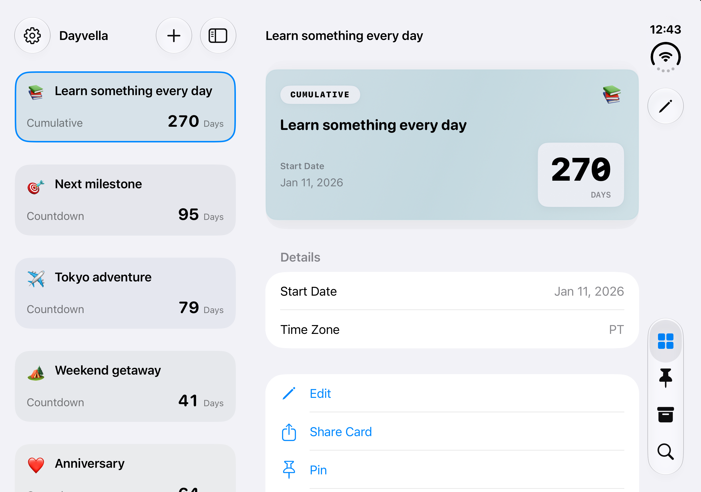
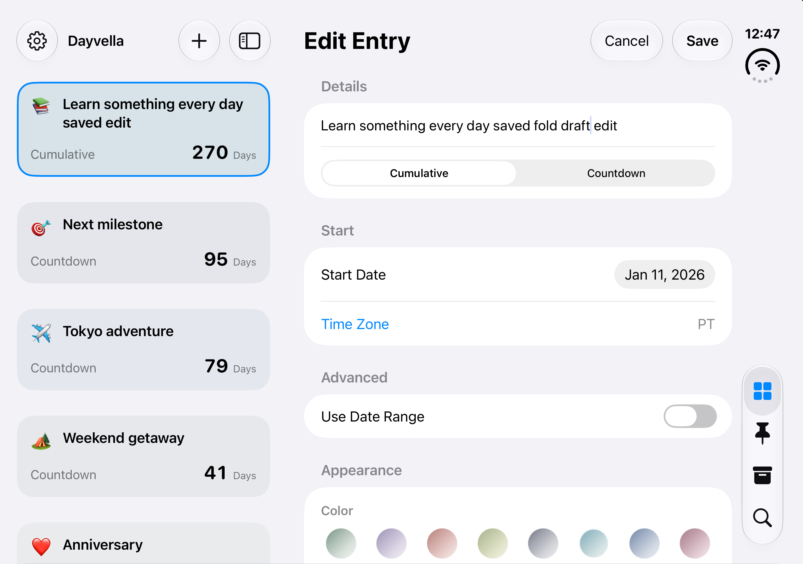
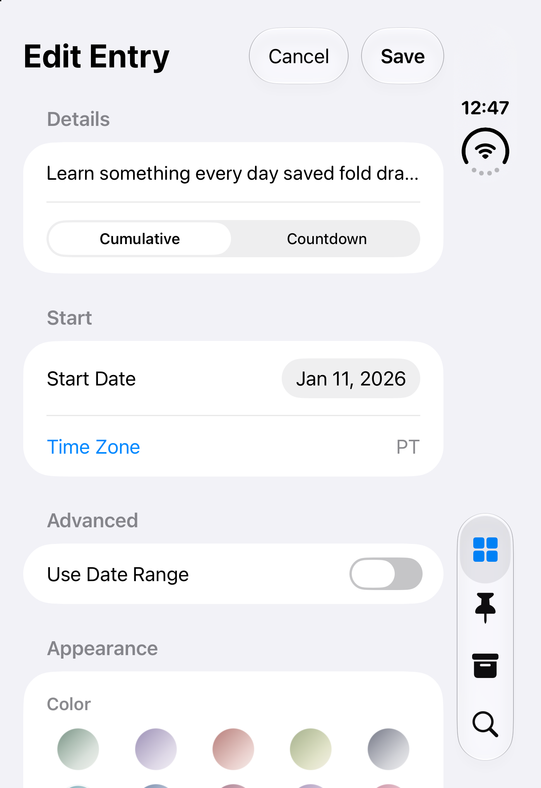

# Adaptive entry workspace — 1.4 (121)

The home screen now uses `NavigationSplitView`: a compact date list beside the selected entry detail in a wide window, and native navigation between the same destinations in a narrow window. Editing replaces the detail pane, keeping the date list available where space permits. Native tabs and toolbars adapt to the system bar arrangement.

The workspace owns the selected entry ID and draft value. Changes feed back from the editor without writing to storage. Save commits once and returns to detail; failed saves retain the draft. Cancel discards the draft. Selecting another entry or starting another editor prompts before discarding an active draft. Deleting the selected entry chooses the next available detail or returns to an empty list. Returning from a cancelled first-entry editor shows the list. Empty collections and empty search results use one full-width empty state rather than separate sidebar and detail messages.

All, Pinned, Archived, and Search use independent filters over published entries. Search includes archived entries and matches localized entry types, titles, and notes. Summary rows wrap long titles, and card date/count groups fall back to a vertical arrangement. Editor colors use an adaptive grid and date fields use native compact pickers.

The PR includes the previously prepared 11-language runtime catalogs and localization fixes needed by the workspace. New selection and discard strings are translated in all 11 languages. The app and widget retain the existing bundle IDs, App Group, iCloud identity, WidgetKit kind, storage path, and JSON schema. The submitted 1.3 (120) build is unaffected.

## Real simulator captures

Dedicated device: Dayvella Duo Design, iOS 27.1, Xcode 27.1 (27A9269). All entries are synthetic.

## Verification

- Xcode 27.1 simulator build and UI tests passed: saving updates the selected detail, cancelling preserves the original title, and rotating preserves the draft.
- A temporary instrumented UI check continuously asserted the title draft while Device Hub changed Open to Closed to Book. It passed, and the same unsaved title was observed in both compact and expanded editors. The timing-dependent manual harness is not part of the permanent suite.
- 29 core tests passed, covering date calculations, import validation, reminders, and sync snapshots.
- Localization validation passed for 165 app keys and 5 widget keys across 11 languages, including compiler extraction, compiled resources, plural arguments, and technical tokens.

## Limits

Validation used the simulator, not physical Duo hardware. The complete matrix of all locales, largest accessibility text, keyboard configurations, sharing and confirmation dialogs in every pose has not been manually exercised. The app uses native navigation regions rather than a custom hinge geometry or model-name check. Scroll restoration and keyboard focus across physical display transitions remain governed by the native containers; draft values and selection are explicitly retained.
